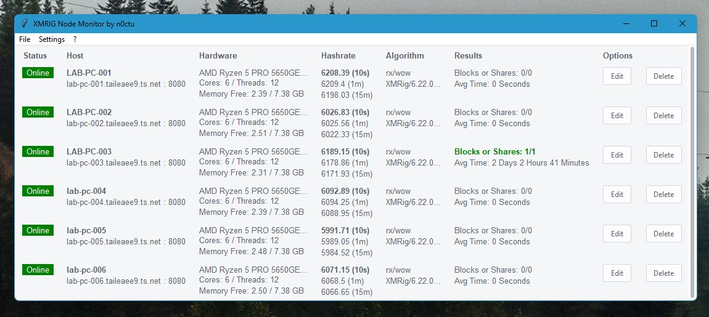

# Py XMRIG Monitor
I was experimenting with solo mining (space heating lol) and got too lazy to log into every box to check whether it's still doing its thing. So I decided to put this very simple ttk interface together. It basically fetches the data from the miners API (/2/summary) and displays some useful information in a table.



# Installation 

1. Clone the repository
2. Go to the project directory
3. Install the required packages
4. Run main.py

```bash
git clone https://github.com/n0ctu/py-xmrig-monitor.git
cd py-xmrig-monitor
pip install -r .\requirements.txt
python main.py
```

# Usage

1. Add a new host by clicking the "Add Host" button in the Settings menu
2. Enter the host's IP address and submit
3. Enter the host's Port number and submit
4. Wait for the program to fetch data!

Make sure to enable the XMRIG API on the miner. You can do this by starting XMRIG with the following arguments. Example:

```bash
xmrig --url your-server --user Wo4yoPKX3QMW9vxmstv9Ga5BpivDQUBgVKbZCSzyhEpoAqJewnGB6gJAc1arcXehR1PcXFoVDt4yv2SyRDQDvrP12W4pZeBhb --algo rx/wow --http-port=8080 --http-host=0.0.0.0
```